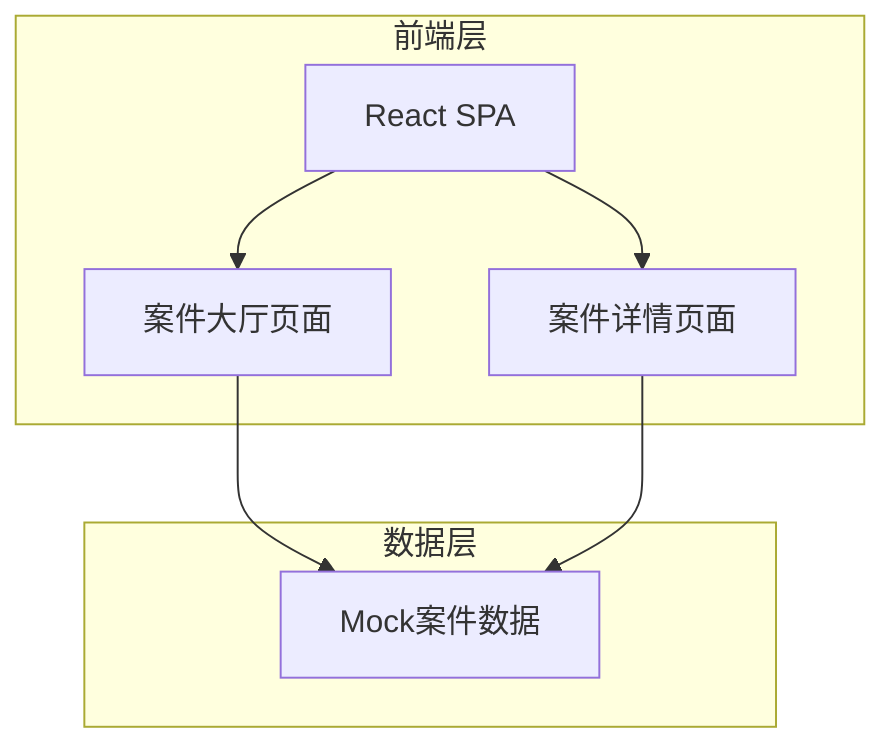
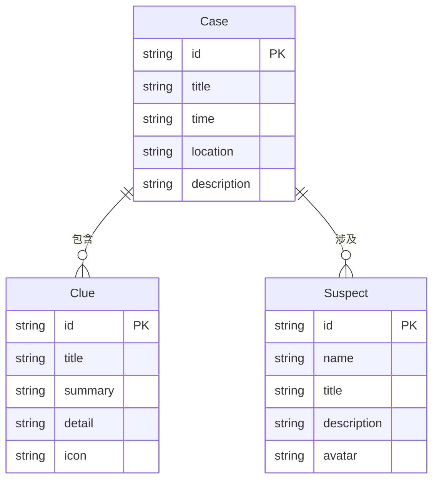

## 1. 架构设计



纯前端SPA应用，无后端服务，使用本地Mock数据驱动。

## 2. 技术说明

- 前端：React@18 + TypeScript + Tailwind CSS@3 + Vite
- 初始化工具：Vite (create-vite)
- 后端：无（纯前端）
- 数据库：无（使用本地Mock数据）
- 动画库：Framer Motion
- 路由：React Router@6

## 3. 路由定义

| 路由 | 用途 |
|------|------|
| / | 案件大厅，展示所有案件卡片 |
| /case/:id | 案件详情，展示线索和嫌疑人选择 |

## 4. API定义

无后端API，使用前端Mock数据。

### 数据类型定义

```typescript
interface Clue {
  id: string;
  title: string;
  summary: string;
  detail: string;
  icon: string;
}

interface Suspect {
  id: string;
  name: string;
  title: string;
  description: string;
  avatar: string;
}

interface Case {
  id: string;
  title: string;
  time: string;
  location: string;
  description: string;
  clues: Clue[];
  suspects: Suspect[];
}
```

## 5. 服务器架构图

无后端服务器。

## 6. 数据模型

### 6.1 数据模型定义



### 6.2 Mock数据

预置3-4个完整的案件数据，每个案件包含3条线索和3-4位嫌疑人，数据存储在前端 `src/data/cases.ts` 中。
